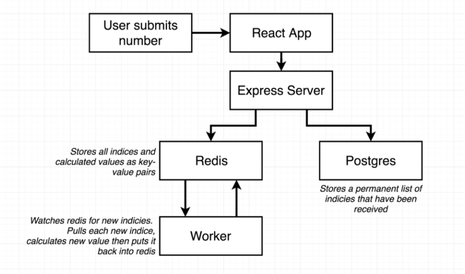

# Multi-Container Architecture Application

In this project, I will set up a multi-container application ( simple app with complex architecture ) with Reactjs for frontend, Expressjs for backend, Postgres for Database, Redis for caching database, and worker process with expressjs. For the DevOps Automation tools, I will use CI/CD with GitLab, docker for containization, and AWS Elastic BeanStalk for production server.

**This project is part of my DevOps Challenge activities in which I practice my DevOps Skills and other backend technologies.**
Github repo link - <https://github.com/Kyawkhaing444/DevOpsChallenge>
